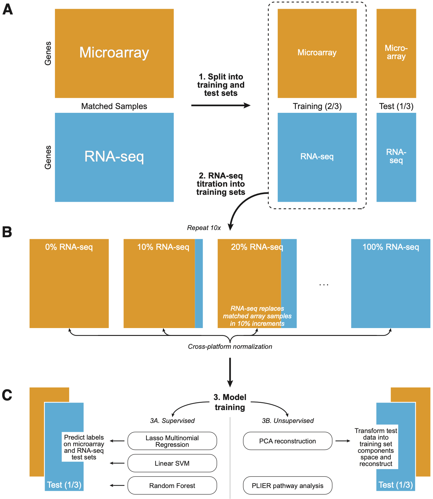
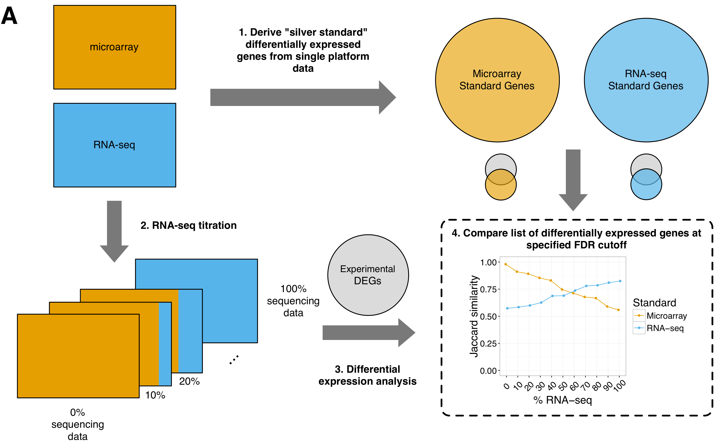

# Cross-platform normalization enables machine learning model training on microarray and RNA-seq data simultaneously

<!-- START doctoc generated TOC please keep comment here to allow auto update -->
<!-- DON'T EDIT THIS SECTION, INSTEAD RE-RUN doctoc TO UPDATE -->
**Table of Contents**  *generated with [DocToc](https://github.com/thlorenz/doctoc)*

- [Summary](#summary)
- [Requirements](#requirements)
  - [Obtaining and running the Docker container](#obtaining-and-running-the-docker-container)
- [Download data from The Cancer Genome Atlas (TCGA)](#download-data-from-the-cancer-genome-atlas-tcga)
- [Recreate manuscript results](#recreate-manuscript-results)
- [Methods](#methods)
  - [Machine Learning Pipeline](#machine-learning-pipeline)
  - [Differential Expression Pipeline](#differential-expression-pipeline)
- [Running individual experiments](#running-individual-experiments)
    - [Machine learning](#machine-learning)
    - [Differential expression](#differential-expression)
    - [Other scripts](#other-scripts)
- [Manuscript versions](#manuscript-versions)
- [Funding](#funding)

<!-- END doctoc generated TOC please keep comment here to allow auto update -->

## Summary

We performed a series of supervised and unsupervised machine learning 
evaluations, as well as differential expression and pathway analyses, to assess which 
normalization methods are best suited for combining data from microarray and 
RNA-seq platforms. 

We evaluated six normalization approaches for all methods: 

1. log-transformation (LOG) 
2. [non-paranormal transformation](https://arxiv.org/abs/0903.0649) (NPN)
3. [quantile normalization](http://bmbolstad.com/misc/normalize/bolstad_norm_paper.pdf) (QN)
4. quantile normalization followed by z-scoring (QN-Z)
5. [Training Distribution Matching](https://peerj.com/articles/1621/) (TDM)
6. z-scoring (Z)


## Requirements

We recommend using the docker image `envest/rnaseq_titration_results:R-4.1.2` to handle package and dependency installation.
See `docker/R-4.1.2/Dockerfile` for more information.

Our analysis ([v2.0](https://github.com/greenelab/RNAseq_titration_results/releases/tag/v2.0)) was run using 7 cores on an AWS instance with 16 cores, 128 GB memory, and an allocated 1 TB of space.

### Obtaining and running the Docker container

Pull the docker image using:

```
docker pull envest/rnaseq_titration_results:R-4.1.2
```

Then run the command to start up a container, replacing <PASSWORD> with your own password:

```
docker run --mount type=bind,target=/home/rstudio,source=$PWD -e PASSWORD=<PASSWORD> -p 8787:8787 envest/rnaseq_titration_results:R-4.1.2
```

Navigate to <http://localhost:8787/> and login to the RStudio server with the username `rstudio` and the password you set above.


## Download data from The Cancer Genome Atlas (TCGA)

TCGA data from 520 breast cancer (BRCA) patients used for these analyses
is [available at zenodo](https://zenodo.org/record/58862).

Data from 150 glioblastoma (GBM) patients is available from the [Genomic Data Commons PanCan Atlas](https://gdc.cancer.gov/about-data/publications/pancanatlas).

To download data, run the data download script in the top directory:

```
bash download_TCGA_data.sh
```

## Recreate manuscript results

After data has been downloaded, running

```
bash run_all_analyses_and_plots.sh
```

with [v2.0](https://github.com/greenelab/RNAseq_titration_results/releases/tag/v2.0) of this repository will reproduce the results presented in our manuscript.
We recommend running all analyses within the project Docker container.

## Methods

### Machine Learning Pipeline

Here's a schematic overview of our machine learning experiments:



**Overview of supervised and unsupervised machine learning experiments.** 

1. Matched samples run on both microarray and RNA-seq were split into a training (2/3) and holdout set (1/3).
2. RNA-seq samples were "titrated" into the training set, 10% at a time (0-100%), replacing their matched array samples, resulting in eleven training sets for each normalization method. 
3. Machine learning applications

  - _Supervised learning_: 
Three classifiers – LASSO, linear SVM, and Random Forest — were trained on each training set and tested on the microarray and RNA-seq holdout sets.
The models were trained to predict tumor subtype (5 classes), and the binary mutation status of _TP53_ and _PIK3CA_.

  - _Unsupervised learning_: 
Holdout sets were projected onto and back out of the training set space using Principal Components Analysis to obtain reconstructed holdout sets.
The trained subtype classifiers were used to predict on the reconstructed holdout sets.
[PLIER](https://github.com/wgmao/PLIER) (Pathway-Level Information ExtractoR) identified coordinated sets of genes in each cancer type.

### Differential Expression Pipeline

Here's a schematic overview of our main differential expression experiment:



**Overview of differential expression experiment.** 

1. All matched samples were considered when building the platform-specific “silver standards.”
These standards are the genes that were differentially expressed at a specified False Discovery Rate (FDR) using data sets comprised entirely of one platform and processed in a standard way: log2-transformed 
microarray data and “untransformed” RNA-seq data. 
2. RNA-seq samples were "titrated" into the data set, 10% at a time (0-100%), replacing their matched array samples, resulting in eleven experimental sets for each normalization method. 
3. Differentially expressed genes (DEGs) were identified usingthe `limma` package.
For BRCA, we compared the Her2 and LumA subtypes as well as Basal v. all other subtypes. 
For GBM, we compared the Classical and Mesenchymal subtypes as well as Proneural v. all other subtypes.
4. Lists of experimental DEGs were compared to standard genesets using Jaccard similarity and Spearman rank correlation. 

In the "small n" experiment, between 3 and 50 samples were selected from each subtype for DEG comparison.


## Running individual experiments

#### Machine learning

To run the machine learning pipeline, run in top directory:

```
bash run_machine_learning_experiments.sh [cancer type] [prediction task] [n cores]
```

where 

- `[cancer type]` is `BRCA` or `GBM`
- `[prediction task]` is `subtype`, `TP53`, or `PIK3CA`
- `[n cores]` is the number of cores you want to run in parallel

#### Differential expression

⚠️ _This requires the data to be processed to include matched samples only, and split into training and test sets via `0-expression_data_overlap_and_split.R` in the machine learning pipeline._

To run the differential expression pipeline, run in top directory:

```
bash run_differential_expression_experiments.sh [cancer type] [subtype vs others] [subtype vs subtype] [subtype vs subtype small] [n cores]
```

where 

- `[cancer type]` is `BRCA` or `GBM`
- `[subtype vs others]` is the subtype to be compared against all other subtypes
- `[subtype vs subtype]` are the two subtypes to be compared (comma-separated, e.g. `Her2,LumA`)
- `[subtype vs subtype small]` are the two subtypes to be compared at small sample sizes (comma-separated, e.g. `Her2,LumA`)
- `[n cores]` is the number of cores you want to run in parallel

#### Other scripts

To search for the number of publicly available microarray and RNA-seq samples from [GEO](https://www.ncbi.nlm.nih.gov/geo/) and [ArrayExpress](https://www.ebi.ac.uk/arrayexpress/), run

```
python3 search_geo_arrayexpress.py
```
and check the output in `results/array_rnaseq_ratio`.

## Manuscript versions

| Version | Relevant links |
| :------ | :------------- |
| [v2.0](https://github.com/greenelab/RNAseq_titration_results/releases/tag/v2.0) | [Figshare+ data](https://doi.org/10.25452/figshare.plus.19629864.v1), [Data for plots](https://doi.org/10.6084/m9.figshare.19686453)   |
| [v1.1](https://github.com/greenelab/RNAseq_titration_results/releases/tag/v1.1) |  [Figshare full results](https://doi.org/10.6084/m9.figshare.5035997.v2) |
| [v1.0](https://github.com/greenelab/RNAseq_titration_results/releases/tag/v1.0) | [Pre-print](https://doi.org/10.1101/118349) |

## Funding

This work was supported by the Gordon and Betty Moore Foundation [GBMF 4552], Alex's Lemonade Stand Foundation [GR-000002471], and the National Institutes of Health [T32-AR007442, U01-TR001263, R01-CA237170, K12GM081259].
